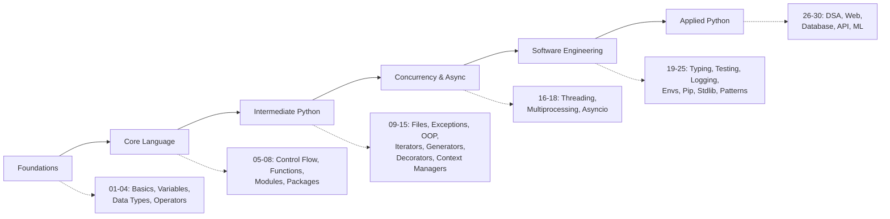

<div align="center">

# 🐍 Python Knowledge Base

**A structured, beginner-to-advanced Python learning repository — documentation, runnable examples, and real mini-projects in one place.**


</div>

---

## 📖 Overview

**Python Knowledge Base** is a self-contained learning resource that takes you from `print("Hello, World!")` to asyncio, design patterns, REST APIs, and machine learning basics — with notes, diagrams, runnable code, and projects for every stop along the way.

Every chapter follows the same format: **theory → syntax → examples → best practices → common mistakes → interview questions → exercises**. Every mini-project is a small, real, working piece of software you can run today and extend tomorrow.

> 📌 **Status note:** This repository is being built incrementally, chapter by chapter, to keep quality high rather than generating shallow placeholders. See the [Progress Tracker](#-progress-tracker) below for what's complete vs. planned.

---

## 🗺️ Learning Roadmap



---

## ✅ Progress Tracker

| # | Chapter | Docs | Code | Status |
|---|---------|:---:|:---:|:---:|
| 01 | Python Basics | ✅ | ✅ | Complete |
| 02 | Variables | ✅ | ✅ | Complete |
| 03 | Data Types | ✅ | ✅ | Complete |
| 04 | Operators | 🚧 | 🚧 | Planned |
| 05 | Control Flow | 🚧 | 🚧 | Planned |
| 06 | Functions | 🚧 | 🚧 | Planned |
| 07 | Modules | 🚧 | 🚧 | Planned |
| 08 | Packages | 🚧 | 🚧 | Planned |
| 09 | File Handling | 🚧 | 🚧 | Planned |
| 10 | Exception Handling | 🚧 | 🚧 | Planned |
| 11 | OOP | 🚧 | 🚧 | Planned |
| 12 | Iterators | 🚧 | 🚧 | Planned |
| 13 | Generators | 🚧 | 🚧 | Planned |
| 14 | Decorators | 🚧 | 🚧 | Planned |
| 15 | Context Managers | 🚧 | 🚧 | Planned |
| 16 | Multithreading | 🚧 | 🚧 | Planned |
| 17 | Multiprocessing | 🚧 | 🚧 | Planned |
| 18 | Asyncio | 🚧 | 🚧 | Planned |
| 19 | Typing | 🚧 | 🚧 | Planned |
| 20 | Testing | 🚧 | 🚧 | Planned |
| 21 | Logging | 🚧 | 🚧 | Planned |
| 22 | Virtual Environments | 🚧 | 🚧 | Planned |
| 23 | Pip | 🚧 | 🚧 | Planned |
| 24 | Standard Library | 🚧 | 🚧 | Planned |
| 25 | Design Patterns | 🚧 | 🚧 | Planned |
| 26 | DSA | 🚧 | 🚧 | Planned |
| 27 | Web | 🚧 | 🚧 | Planned |
| 28 | Database | 🚧 | 🚧 | Planned |
| 29 | API | 🚧 | 🚧 | Planned |
| 30 | Machine Learning | 🚧 | 🚧 | Planned |

**Legend:** ✅ Complete · 🚧 Skeleton exists, content planned · Folder structure for **all 30 chapters** already exists in `docs/` and `src/`.

---

## 📂 Chapter Directory

<details>
<summary><strong>Click to expand full chapter list</strong></summary>

| Range | Theme | Chapters |
|-------|-------|----------|
| 01–04 | Foundations | Python Basics, Variables, Data Types, Operators |
| 05–08 | Core Language | Control Flow, Functions, Modules, Packages |
| 09–15 | Intermediate Python | File Handling, Exception Handling, OOP, Iterators, Generators, Decorators, Context Managers |
| 16–18 | Concurrency | Multithreading, Multiprocessing, Asyncio |
| 19–25 | Software Engineering | Typing, Testing, Logging, Virtual Environments, Pip, Standard Library, Design Patterns |
| 26–30 | Applied Python | DSA, Web, Database, API, Machine Learning |

</details>

---

## 🚀 Project Showcase

| Level | Project | Description | Status |
|-------|---------|-------------|:---:|
| Beginner | [Calculator](projects/beginner/calculator) | CLI calculator with a clean expression parser | ✅ |
| Beginner | [Number Guessing Game](projects/beginner/number_guessing_game) | Interactive guessing game with difficulty levels | ✅ |
| Beginner | Password Generator | Configurable secure password generator | 🚧 |
| Beginner | Rock Paper Scissors | Classic game vs. computer | 🚧 |
| Beginner | Unit Converter | Multi-category unit conversion CLI | 🚧 |
| Beginner | Todo CLI | Persistent command-line todo list | 🚧 |
| Intermediate | Expense Tracker | Track and categorize expenses with reports | 🚧 |
| Intermediate | Weather App | Live weather via public API | 🚧 |
| Intermediate | Web Scraper | Scrape and structure web data | 🚧 |
| Intermediate | File Organizer | Auto-organize files by type/date | 🚧 |
| Intermediate | Markdown Converter | Markdown → HTML converter | 🚧 |
| Intermediate | Image Renamer | Batch rename/organize images | 🚧 |
| Intermediate | CSV Analyzer | Analyze and summarize CSV datasets | 🚧 |
| Intermediate | Flashcard App | Spaced-repetition flashcard CLI | 🚧 |
| Advanced | REST API (FastAPI) | Full CRUD REST API | 🚧 |
| Advanced | Task Manager | Multi-user task manager backend | 🚧 |
| Advanced | Chat Server | Socket-based multi-client chat server | 🚧 |
| Advanced | Automation Toolkit | Scripting utilities for common automation | 🚧 |
| Advanced | SQLite CRUD App | Full SQLite-backed CRUD app | 🚧 |
| Advanced | Multithreaded Downloader | Concurrent file downloader | 🚧 |

---

## 🌳 Repository Structure

```
Python-Knowledge-Base/
├── README.md
├── LICENSE
├── requirements.txt
├── .gitignore
├── docs/                      # Markdown notes, one folder per chapter
│   ├── 01_python_basics/
│   ├── 02_variables/
│   ├── ...
│   └── 30_machine_learning/
├── src/                       # Runnable example code, mirrors docs/
│   ├── 01_python_basics/
│   ├── 02_variables/
│   ├── ...
│   └── 30_machine_learning/
├── projects/                  # Mini-projects
│   ├── beginner/
│   ├── intermediate/
│   └── advanced/
└── assets/                    # Diagrams, screenshots
    ├── diagrams/
    └── screenshots/
```

---

## ⚙️ Installation

```bash
git clone https://github.com/your-username/Python-Knowledge-Base.git
cd Python-Knowledge-Base
```

### Virtual Environment Setup

```bash
# Create the environment
python3 -m venv venv

# Activate it
source venv/bin/activate      # macOS / Linux
venv\Scripts\activate         # Windows

# Install dependencies
pip install -r requirements.txt
```

### Running Examples

Every script in `src/` is standalone and runnable:

```bash
python src/01_python_basics/hello_world.py
```

### Running Tests

```bash
pytest
```

---

## 📚 Documentation

Each chapter in `docs/` follows a consistent structure: introduction, theory, syntax, examples, diagrams (Mermaid), best practices, common mistakes, interview questions, exercises, and further reading. Start at [`docs/01_python_basics`](docs/01_python_basics) and work forward, or jump to whatever chapter you need.

---

## 🔭 Future Roadmap

- [ ] Complete docs + code for chapters 04–30
- [ ] Build out remaining 18 mini-projects
- [ ] Add a searchable glossary and FAQ
- [ ] Add a cheat-sheet PDF export
- [ ] Add CI (lint + test) via GitHub Actions
- [ ] Add solutions branch for exercises

---

## 🤝 Contributing

Contributions are welcome. To contribute:

1. Fork the repository
2. Create a feature branch (`git checkout -b feature/chapter-04-operators`)
3. Follow the existing chapter format (see [Documentation Format](#-documentation))
4. Ensure all code passes `ruff` and `mypy`
5. Open a pull request

---

## 📄 License

This project is licensed under the [MIT License](LICENSE).

---

## 👤 Author

Maintained by **Aryan** — competitive programmer and full-stack developer.
LeetCode: [aryanexe07](https://leetcode.com/aryanexe07)

---

## 📎 Resources

- [Official Python Docs](https://docs.python.org/3/)
- [PEP 8 — Style Guide](https://peps.python.org/pep-0008/)
- [Real Python](https://realpython.com/)
- [Python Standard Library](https://docs.python.org/3/library/)

---

## 📊 GitHub Statistics

<!-- Replace `your-username` once this repo is pushed to GitHub -->


