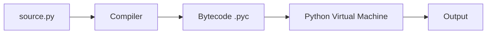

# 01 · Python Basics

## Introduction

Python is a high-level, interpreted, dynamically-typed programming language known for readable syntax and a "batteries included" standard library. This chapter covers what Python is, how it runs, and how to write and execute your first programs.

## Theory

When you run a `.py` file, CPython (the reference implementation) compiles your source into **bytecode**, then executes that bytecode on the Python Virtual Machine (PVM). This is why Python is often called "interpreted" even though a compilation step happens internally.



Key characteristics:

- **Dynamically typed** — variable types are checked at runtime, not compile time.
- **Interpreted** — no separate manual compilation step for the developer.
- **Indentation-based** — blocks are defined by whitespace, not braces.
- **Multi-paradigm** — supports procedural, object-oriented, and functional styles.

## Syntax

```python
# This is a comment
print("Hello, World!")   # function call

# Statements end at the newline, no semicolon required
x = 5
y = 10
print(x + y)
```

## Examples

See [`src/01_python_basics/hello_world.py`](../../src/01_python_basics/hello_world.py) and [`src/01_python_basics/comments.py`](../../src/01_python_basics/comments.py) for runnable code.

## Code Explanation

- `print()` is a built-in function that writes to standard output.
- Python statements are executed top-to-bottom; there's no `main()` requirement, though larger programs conventionally use an `if __name__ == "__main__":` guard (introduced properly in Chapter 07: Modules).
- The `#` character starts a comment; everything after it on that line is ignored by the interpreter.

## Best Practices

- Save files with the `.py` extension and use `snake_case` filenames.
- Use `python3` explicitly on systems where `python` may point to Python 2.
- Keep one statement per line — Python allows `;`-separated statements on one line, but it hurts readability.
- Follow [PEP 8](https://peps.python.org/pep-0008/) from day one; it becomes muscle memory faster than you'd expect.

## Common Mistakes

| Mistake | Why it's a problem | Fix |
|---|---|---|
| Mixing tabs and spaces | Causes `TabError` or silent misalignment | Configure your editor to insert spaces only |
| Forgetting `print()` parentheses (Python 2 habit) | `print "x"` is a `SyntaxError` in Python 3 | Always use `print(x)` |
| Assuming `python` = Python 3 | Some systems still alias `python` to Python 2 | Use `python3` or check `python --version` |

## Interview Questions

1. What's the difference between a compiled and an interpreted language, and where does Python sit?
2. What is CPython, and how does it relate to "Python"?
3. Why does Python use indentation instead of braces?

## Exercises

1. Write a script that prints your name, your favorite language feature, and today's date (hardcoded is fine for now).
2. Modify `hello_world.py` to print three lines using three separate `print()` calls, then again using a single call with `\n`.
3. Add three different types of comments (line comment, inline comment, block comment) to a script.

## Further Reading

- [Python official tutorial](https://docs.python.org/3/tutorial/)
- [PEP 8 Style Guide](https://peps.python.org/pep-0008/)

## Related Topics

- [02 · Variables](../02_variables/README.md)
- [07 · Modules](../07_modules/README.md)
