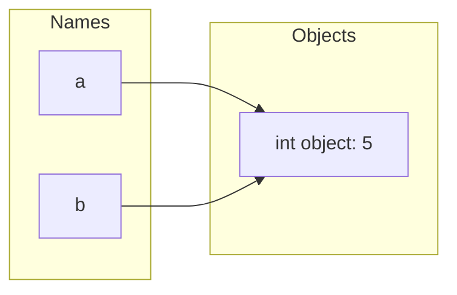

# 02 · Variables

## Introduction

A variable in Python is a name bound to an object in memory. Unlike statically-typed languages, you don't declare a type — the type lives with the *object*, not the *name*.

## Theory

Python variables are **references (labels)**, not boxes that hold values directly. Assignment binds a name to an object; multiple names can point to the same object.



```python
a = 5
b = a       # b now points to the same int object as a
a = 10      # a is rebound to a new object; b still points to 5
print(a, b) # 10 5
```

## Syntax

```python
x = 10                 # simple assignment
name = "Aryan"
is_active = True

x, y, z = 1, 2, 3       # multiple assignment
a = b = c = 0            # chained assignment

count = 0
count += 1               # augmented assignment (count = count + 1)
```

## Examples

See [`src/02_variables/variables.py`](../../src/02_variables/variables.py) and [`src/02_variables/constants.py`](../../src/02_variables/constants.py).

## Code Explanation

- `x, y, z = 1, 2, 3` unpacks a tuple `(1, 2, 3)` into three names in one statement.
- `a = b = c = 0` binds all three names to the *same* `0` object — safe here because integers are immutable, but risky with mutable objects like lists (`a = b = []` means `a` and `b` share one list).
- Naming rules: must start with a letter or underscore, followed by letters/digits/underscores; case-sensitive; cannot be a reserved keyword (`class`, `for`, `import`, ...).

## Best Practices

- Use descriptive `snake_case` names: `user_count`, not `uc` or `UserCount`.
- Treat ALL-CAPS names as a convention for constants: `MAX_RETRIES = 3` (Python has no true constants — this is a signal, not enforcement).
- Avoid single-letter names except in short-lived loop counters (`i`, `j`) or well-known math contexts.
- Don't reuse a variable name for two unrelated purposes in the same scope.

## Common Mistakes

| Mistake | Why it's a problem | Fix |
|---|---|---|
| `a = b = []` then mutating `a` | `b` changes too — they're the same list | Use `a = []; b = []` for independent objects |
| Shadowing built-ins (`list = [1, 2, 3]`) | Hides the built-in `list()` type for the rest of the scope | Avoid built-in names as variable names |
| Using a variable before assignment | Raises `UnboundLocalError` / `NameError` | Ensure assignment happens on all code paths before use |

## Interview Questions

1. Are Python variables more like "labels" or "boxes"? Explain with an example.
2. What happens when you do `a = b = []` and then `a.append(1)`?
3. What's the difference between `is` and `==` when comparing two variables?

## Exercises

1. Predict the output of a snippet using chained assignment with a mutable object, then verify by running it.
2. Write a script that swaps two variables' values without using a temporary third variable (hint: tuple unpacking).
3. Demonstrate the difference between `is` and `==` for two equal-but-distinct list objects.

## Further Reading

- [Python data model](https://docs.python.org/3/reference/datamodel.html)

## Related Topics

- [01 · Python Basics](../01_python_basics/README.md)
- [03 · Data Types](../03_data_types/README.md)
