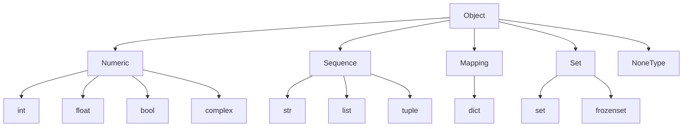

# 03 · Data Types

## Introduction

Every value in Python is an object with a type. This chapter covers the built-in scalar types (`int`, `float`, `bool`, `str`, `NoneType`) and the core collection types (`list`, `tuple`, `dict`, `set`).

## Theory

Python's type hierarchy at a glance:



Two important distinctions:

- **Mutable vs. immutable**: `list`, `dict`, `set` are mutable (can change in place); `int`, `float`, `str`, `tuple`, `bool`, `frozenset` are immutable.
- **Ordered vs. unordered**: `list`, `tuple`, `str` preserve order; `dict` preserves insertion order (guaranteed since 3.7); `set` has no guaranteed order.

## Syntax

```python
# Scalars
i: int = 42
f: float = 3.14
b: bool = True
s: str = "hello"
n: None = None

# Collections
lst: list[int] = [1, 2, 3]
tpl: tuple[int, ...] = (1, 2, 3)
dct: dict[str, int] = {"a": 1, "b": 2}
st: set[int] = {1, 2, 3}
```

## Examples

See [`src/03_data_types/numbers_and_strings.py`](../../src/03_data_types/numbers_and_strings.py) and [`src/03_data_types/collections_demo.py`](../../src/03_data_types/collections_demo.py).

## Code Explanation

- `type(x)` returns an object's exact type; `isinstance(x, T)` checks against a type (and its subclasses) — prefer `isinstance` for checks.
- Strings are immutable sequences of Unicode code points; every "modification" (`.upper()`, `.replace()`, ...) returns a *new* string.
- `list` vs `tuple`: choose `tuple` when the collection's shape is fixed and shouldn't change (e.g., coordinates); choose `list` when you'll append/remove/sort.
- `dict` and `set` both use hashing internally, which is why keys (and set members) must be hashable — meaning immutable in practice.

## Best Practices

- Use type hints (`x: int`) to make intent explicit, even though Python won't enforce them at runtime (see Chapter 19: Typing).
- Prefer `tuple` for fixed-shape data, `list` for homogeneous variable-length sequences.
- Use `set` when you need fast membership tests (`in`) and don't care about order or duplicates.
- Use f-strings for string formatting over `%` or `.format()` in new code.

## Common Mistakes

| Mistake | Why it's a problem | Fix |
|---|---|---|
| `0.1 + 0.2 == 0.3` | Floating point rounding — this is `False` | Use `math.isclose()` for float comparisons |
| Using a `list` as a `dict` key | Lists are unhashable → `TypeError` | Use a `tuple` instead |
| Confusing `[]` with `{}` for an empty set | `{}` is an empty **dict**, not an empty set | Use `set()` for an empty set |

## Interview Questions

1. Why are strings immutable in Python, and what performance implication does that have for repeated concatenation?
2. When would you choose a `tuple` over a `list`, beyond "it can't change"?
3. Why must dictionary keys be hashable, and what does that imply about using lists as keys?

## Exercises

1. Write a function that takes a list of numbers and returns a tuple of `(min, max, average)`.
2. Given a list with duplicates, produce a deduplicated list that preserves original order (hint: you can't just use `set()` directly if order matters).
3. Demonstrate the float-precision pitfall (`0.1 + 0.2`) and fix the comparison using `math.isclose()`.

## Further Reading

- [Python built-in types](https://docs.python.org/3/library/stdtypes.html)

## Related Topics

- [02 · Variables](../02_variables/README.md)
- [04 · Operators](../04_operators/README.md)
