# 04 · Operators

## Introduction

Operators are special symbols in Python that perform operations on one or more operands (values or variables). They are used for arithmetic calculations, comparisons, logical decisions, bit manipulation, membership testing, identity checking, and variable assignment.

Python provides seven major categories of operators:

- Arithmetic operators
- Comparison operators
- Logical operators
- Assignment operators
- Bitwise operators
- Membership operators
- Identity operators

Understanding operators is fundamental because nearly every Python program relies on them.

---

## Theory

Python operators can be classified as follows:

```mermaid
flowchart TD
    Operators --> Arithmetic
    Operators --> Comparison
    Operators --> Logical
    Operators --> Assignment
    Operators --> Bitwise
    Operators --> Membership
    Operators --> Identity

    Arithmetic --> Add["+  Addition"]
    Arithmetic --> Sub["-  Subtraction"]
    Arithmetic --> Mul["*  Multiplication"]
    Arithmetic --> Div["/  Division"]
    Arithmetic --> Floor["// Floor Division"]
    Arithmetic --> Mod["% Modulus"]
    Arithmetic --> Pow["** Exponentiation"]

    Comparison --> Eq["=="]
    Comparison --> Ne["!="]
    Comparison --> Gt[">"]
    Comparison --> Lt["<"]
    Comparison --> Ge[">="]
    Comparison --> Le["<="]

    Logical --> And["and"]
    Logical --> Or["or"]
    Logical --> Not["not"]

    Assignment --> Assign["="]
    Assignment --> PlusEq["+="]
    Assignment --> MinusEq["-="]
    Assignment --> MulEq["*="]
    Assignment --> DivEq["/="]

    Bitwise --> Band["&"]
    Bitwise --> Bor["|"]
    Bitwise --> Bxor["^"]
    Bitwise --> Bnot["~"]
    Bitwise --> Lshift["<<"]
    Bitwise --> Rshift[">>"]

    Membership --> In["in"]
    Membership --> NotIn["not in"]

    Identity --> Is["is"]
    Identity --> IsNot["is not"]
```



### Operator Categories

- **Arithmetic operators** perform mathematical calculations.
- **Comparison operators** compare values and always return a boolean.
- **Logical operators** combine multiple boolean expressions.
- **Assignment operators** modify variable values.
- **Bitwise operators** manipulate individual bits of integers.
- **Membership operators** check whether an object exists inside another iterable.
- **Identity operators** determine whether two variables reference the exact same object in memory.

---

## Syntax

```python
# Arithmetic
a + b
a - b
a * b
a / b
a // b
a % b
a ** b

# Comparison
a == b
a != b
a > b
a < b
a >= b
a <= b

# Logical
x and y
x or y
not x

# Assignment
x += 1
x -= 1
x *= 2
x /= 2

# Bitwise
a & b
a | b
a ^ b
~a
a << 2
a >> 2

# Membership
"x" in text
"x" not in text

# Identity
a is b
a is not b
```

---

## Examples

See [`src/04_operators/operators_demo.py`](../../src/04_operators/operators_demo.py).

---

## Code Explanation

### Arithmetic Operators

Used to perform mathematical operations.

```python
5 + 3
5 ** 3
5 // 3
```

### Comparison Operators

Return either `True` or `False`.

```python
5 > 3
5 == 3
```

### Logical Operators

Operate on boolean expressions.

```python
True and False
True or False
not True
```

Although Python allows expressions like `5 and 3`, they return one of the operands rather than a boolean. For beginners, use logical operators with boolean values.

### Assignment Operators

A shorthand for updating variables.

```python
x += 5
```

is equivalent to

```python
x = x + 5
```

### Bitwise Operators

Operate on the binary representation of integers.

Example:

```text
5 = 0101
3 = 0011

5 & 3 = 0001
5 | 3 = 0111
5 ^ 3 = 0110
```

These are commonly used in low-level programming, networking, graphics, and optimization.

### Membership Operators

Check whether a value exists inside a sequence.

```python
"cat" in "concatenate"
3 in [1, 2, 3]
```

### Identity Operators

Identity checks whether two variables point to the same object.

```python
a = [1,2]
b = a
c = [1,2]

a is b      # True
a is c      # False

a == c      # True
```

`is` compares object identity, while `==` compares values.

---

## Best Practices

- Use `==` for value comparison and reserve `is` for checking against `None`.
- Prefer logical operators with boolean expressions for readability.
- Use compound assignment (`+=`, `*=`, etc.) when updating variables.
- Use parentheses when combining multiple operators to improve readability.
- Avoid unnecessary bitwise operations unless they clearly solve the problem.

---

## Common Mistakes

| Mistake | Why it's a problem | Fix |
|----------|--------------------|-----|
| Using `is` instead of `==` | `is` compares object identity, not values | Use `==` for value comparison |
| Assuming `and` always returns `True` or `False` | It returns one of its operands | Use boolean expressions |
| Confusing `/` with `//` | `/` returns a float, `//` performs floor division | Choose the correct operator |
| Using `=` inside conditions | `=` assigns instead of compares | Use `==` |
| Using bitwise operators instead of logical operators | `&` and `|` are different from `and` and `or` | Use the appropriate operator |

---

## Interview Questions

1. What is the difference between `==` and `is`?
2. Explain the difference between `/` and `//`.
3. What is short-circuit evaluation in logical operators?
4. What is the difference between `and` and `&`?
5. When would you use bitwise operators in real-world applications?
6. Why does `5 and 3` evaluate to `3`?
7. Explain operator precedence in Python.

---

## Exercises

1. Write a program that demonstrates every arithmetic operator.
2. Compare two numbers using every comparison operator.
3. Create a calculator using arithmetic operators.
4. Demonstrate the difference between `==` and `is`.
5. Convert two integers to binary and manually verify the results of `&`, `|`, and `^`.
6. Write a program that checks whether a word exists inside a sentence.
7. Demonstrate short-circuit evaluation using logical operators.

---

## Further Reading

- https://docs.python.org/3/reference/expressions.html
- https://docs.python.org/3/library/operator.html

---

## Related Topics

- [03 · Data Types](../03_data_types/README.md)
- [05 · Conditional Statements](../05_conditionals/README.md)
